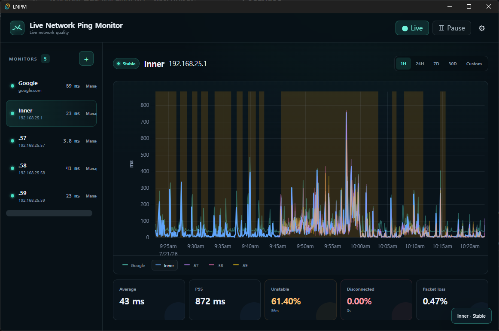

<div align="center">
  
  <h1>Live Network Ping Monitor</h1>
  <p>지연 시간, 패킷 손실, 네트워크 안정성을 실시간으로 파악하는 네이티브 트레이 앱입니다.</p>
  <p>
    <a href="https://github.com/xxsLuna/LNPM/actions/workflows/ci.yml"></a>
    <a href="https://github.com/xxsLuna/LNPM/releases/latest"></a>
    <a href="../../LICENSE"></a>
  </p>
  <p>
    <a href="../../README.md">English</a> ·
    <strong>한국어</strong> ·
    <a href="README.ja.md">日本語</a> ·
    <a href="README.zh-CN.md">简体中文</a> ·
    <a href="README.zh-TW.md">繁體中文</a>
  </p>
  
</div>

LNPM은 Windows, macOS, Linux에서 ICMP 지연 시간과 네트워크 품질을 지속적으로 측정합니다. 측정 데이터는 기기에만 저장되며, 실시간·과거 차트를 통해 간헐적인 불안정과 연결 끊김을 쉽게 확인할 수 있습니다.

## 주요 기능

- 여러 호스트명이나 IPv4/IPv6 주소를 동시에 모니터링합니다.
- 시스템 트레이에서 계속 실행되며 간결한 실시간 상태 팝업을 제공합니다.
- 지연 차트를 드래그하거나 확대해 과거 데이터를 탐색합니다.
- 연결 끊김 구간은 빨간색, 불안정 구간은 주황색으로 표시합니다.
- 평균 지연, P95 지연, 패킷 손실, 지터, 상태별 비율을 계산합니다.
- 대상별 패킷 손실, 지터, P95 판정 기준을 설정합니다.
- 원본 측정값, 분 단위 집계, 품질 구간을 로컬 SQLite 데이터베이스에 저장합니다.
- 보존 기간, 데이터베이스 백업, 로그인 시 자동 시작을 설정합니다.
- 불안정, 연결 끊김, 복구 상태를 네이티브 알림으로 받습니다.
- LNPM 안에서 서명된 업데이트를 진행률과 함께 설치하고, 나중에 알림 또는 특정 버전 건너뛰기를 선택할 수 있습니다.
- 전체 화면, 트레이, 알림을 영어·한국어·일본어·중국어 간체·중국어 번체로 사용할 수 있습니다.

## 네트워크 품질 판정 규칙

기본 분류기는 최근 60초 범위를 사용하며 측정값 10개부터 판정을 시작합니다.

| 상태 | 기본 규칙 |
| --- | --- |
| 불안정 | 패킷 손실 >= 5%, 지터 >= 30ms 또는 P95 지연 >= 150ms 상태가 10초 지속 |
| 연결 끊김 | 연속 5회 측정 실패 |
| 불안정에서 복구 | 모든 지표가 30초 동안 기준값 아래로 유지 |
| 연결 끊김에서 복구 | 연속 3회 측정 성공 |

세 가지 불안정 기준값은 대상마다 독립적으로 변경할 수 있습니다.

## 다운로드

[GitHub Releases](https://github.com/xxsLuna/LNPM/releases/latest)에서 운영체제에 맞는 패키지를 다운로드하세요.

- Windows: NSIS `.exe` 또는 Windows Installer `.msi`
- macOS: Apple Silicon 또는 Intel용 `.dmg`
- Linux: `.AppImage` 또는 Debian `.deb`

초기 커뮤니티 빌드는 코드 서명되지 않았습니다. 이 저장소에서 다운로드한 파일이라도 Windows SmartScreen이나 macOS Gatekeeper가 알 수 없는 게시자 경고를 표시할 수 있습니다.

업데이트 패키지는 별도의 Tauri updater 키로 서명되며 설치 전에 검증됩니다. LNPM v0.1.0에는 updater가 없으므로 v0.2.0으로 자동 업데이트할 수 없습니다. v0.2.0을 한 번 수동 설치하면 그 이후 릴리스부터 앱 내 업데이트가 동작합니다.

## 로컬 데이터

모든 대상, 측정값, 설정, 집계 데이터는 로컬 SQLite 데이터베이스에 저장됩니다. LNPM은 모니터링 데이터를 업로드하지 않습니다. 설정된 측정 대상에 연결하며, 공식 Tauri Updater가 앱 시작 시와 실행 중 30분마다 GitHub Releases의 서명된 `latest.json`을 확인합니다.

정확한 데이터 폴더는 **설정 -> 데이터 -> 폴더 열기**에서 확인할 수 있습니다.

## 개발

필수 환경:

- Rust 안정 버전 툴체인(Rust 1.85 이상)
- Node.js 22 이상
- pnpm 11.9
- [Tauri 2 플랫폼 필수 구성 요소](https://v2.tauri.app/start/prerequisites/)

```powershell
pnpm install --frozen-lockfile
pnpm tauri dev
```

전체 로컬 검사를 실행합니다.

```powershell
pnpm test
pnpm build
cargo fmt --manifest-path src-tauri/Cargo.toml --all -- --check
cargo test --manifest-path src-tauri/Cargo.toml --locked
cargo clippy --manifest-path src-tauri/Cargo.toml --locked --all-targets --all-features -- -D warnings
```

Docker로 일부 프런트엔드 및 Rust 검사를 실행할 수 있지만 네이티브 트레이, 알림, ICMP 권한, WebView, 플랫폼 설치 패키지는 안정적으로 테스트할 수 없습니다. 해당 검사는 GitHub가 제공하는 Windows, macOS, Linux 네이티브 러너에서 실행됩니다.

## 릴리스 절차

모든 push와 pull request는 크로스 플랫폼 CI 워크플로로 검증됩니다. `v0.2.1`과 같은 버전 태그를 만들면 릴리스 워크플로가 시작됩니다. 모든 플랫폼 빌드가 성공하고 설치 파일, updater 서명, 통합 `latest.json` 검증이 끝난 뒤에만 릴리스가 공개됩니다.

기여 방법은 [CONTRIBUTING.md](../../CONTRIBUTING.md), 보안 취약점 신고 방법은 [SECURITY.md](../../SECURITY.md)를 참고하세요.

## 프로젝트 관리자

LNPM은 프로젝트 관리자 [@xxsLuna](https://github.com/xxsLuna)가 유지·관리합니다.

## 라이선스

[MIT License](../../LICENSE)에 따라 배포됩니다.
